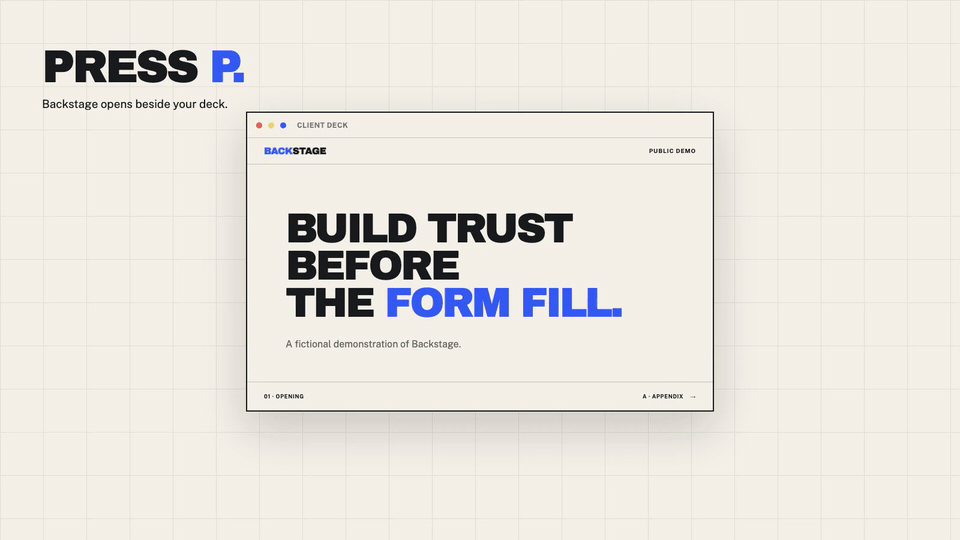

# Backstage

Backstage adds a presenter window to any deck.

Press `P`. A new tab opens with your timer, notes, slide controls and appendix routes. Share the deck window. Keep Backstage beside it.

**[Open the live demo](https://backstage-deck-demo.draper-5413.chatgpt.site)**

[](public/backstage-dual-screen.mp4)

## Run it locally

```bash
npm install
npm run dev
```

Open the local URL, then press `P`. Drag the new tab into a separate window and share only the deck window.

## Demo features

- Two-window slide synchronisation through `BroadcastChannel`
- A 30-minute meeting timer
- A one-click run of show
- Responsive appendix routing for common client objections
- Per-slide `Ask`, `Why`, `Say`, and `Caution` prompts
- Current and next slide states
- Keyboard navigation
- Second-screen setup guidance when the presenter tab opens

## The two-window setup

The deck and presenter window stay in sync through the browser's `BroadcastChannel` API. Click a slide or appendix route in Backstage and the shared deck moves with you.

The Remotion source for the demo above lives in `remotion/`. Run `npm run video:studio` to inspect it or `npm run video:render` to make a fresh MP4.

## Privacy boundary

The fictional runbook in this public demo is safe to inspect. In a real implementation, keep private presenter data out of the public deck bundle. Load it from a local file or an authenticated presenter-only route, keyed by public slide IDs.

The two-window demo uses the browser's `BroadcastChannel` API. Both windows must use the same origin.

## Design language

Broadcast Modernism: Archivo Black, Public Sans, hard cuts, rundown logic, tally red, signal blue and status-only colour.

All companies and results shown in this demo are fictional.

Made by [Draper](https://draperhq.com).

## License

MIT
